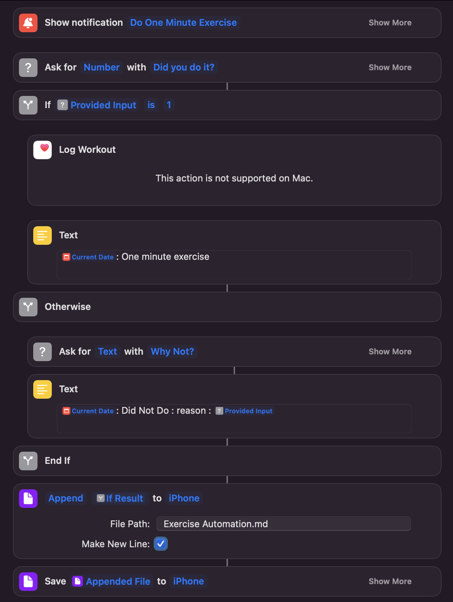

# one min exercise

i add this shortcut to an automation so that when i open apps like twitter, im prompted to do
one minute of exercise. the result is then appended to an [Obsidian file](https://obsidian.md/)

see [habit triggers](https://jamesclear.com/habit-triggers) for more information.

