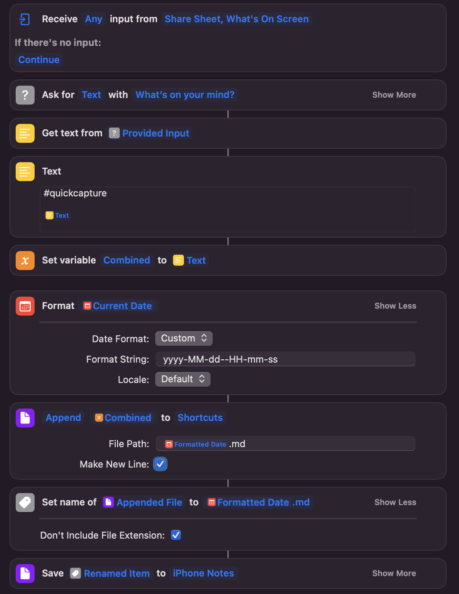

# type a message and save it to an obsidian folder

im saving mine to `iPhone Notes` with the tag `#quickcapture`

add this one to `show in share sheet` to use in most apps without context switching!

